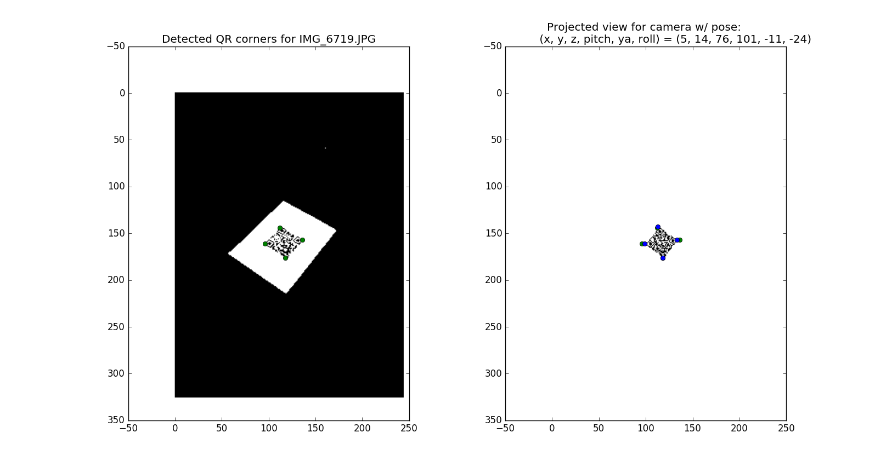
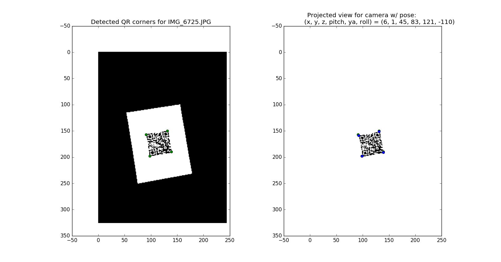
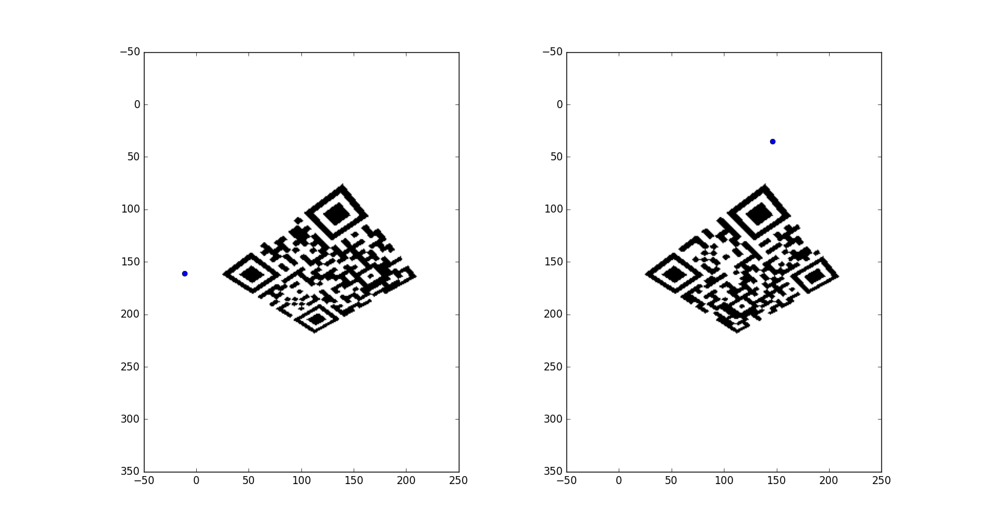
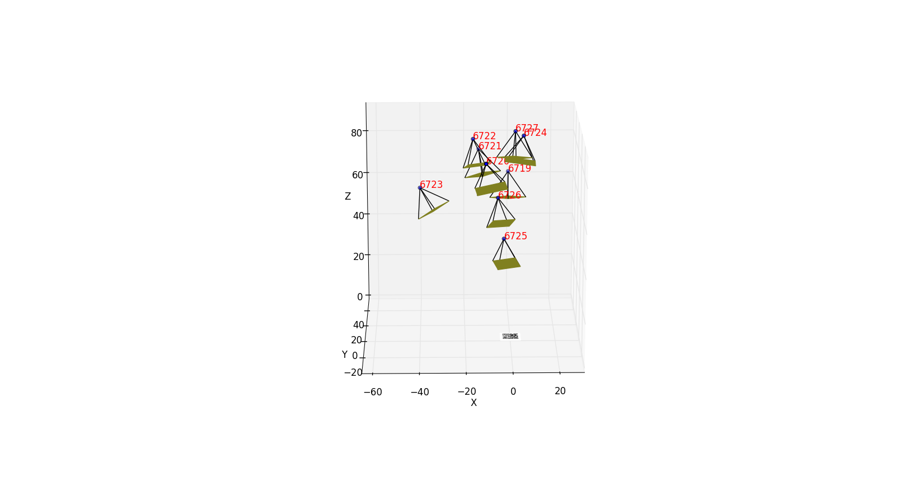
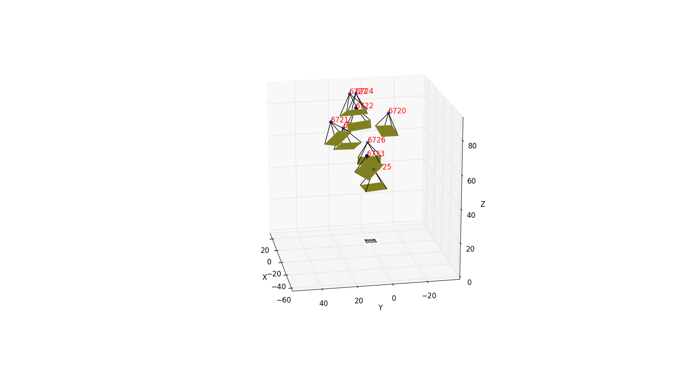
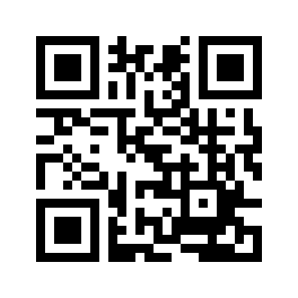
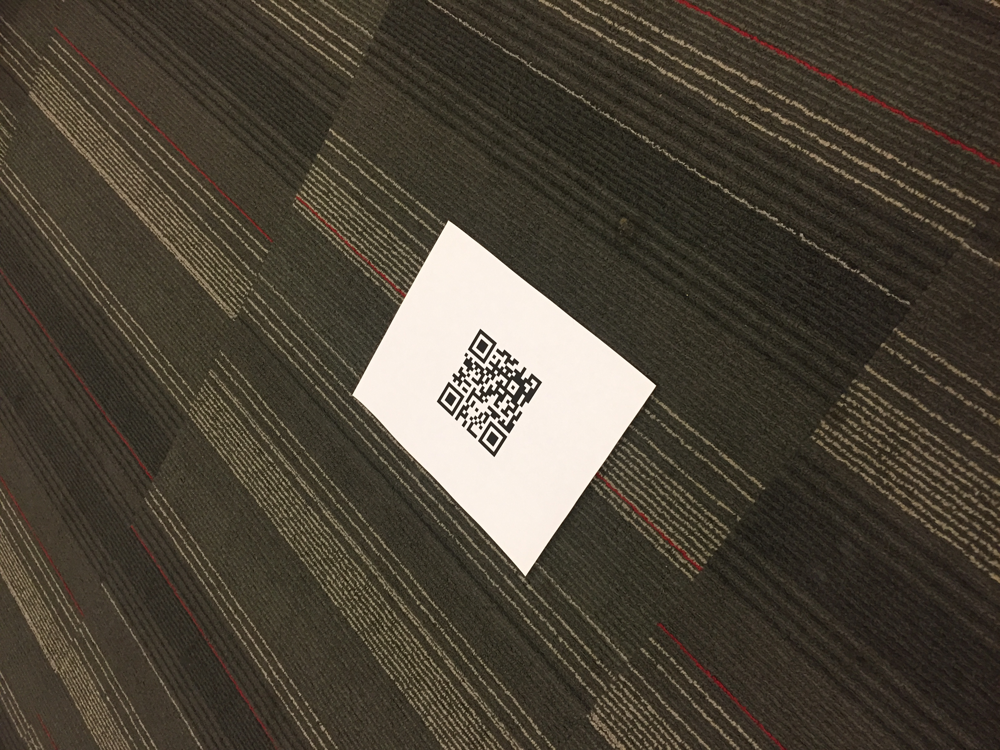

Camera Localization
===================

Repo for DroneDeploy's camera localization challenge.

Run camera_localization.py to get camera pose estimates for each image in the root folder.

## Approach

First, load in and downsample the image by a factor of 10, to save time.
Also, load the pattern and threshold the image.

Locate the QR code within the image.
* Use cv2.findContours to find the boundaries of the piece of paper within the image.
* Identify the black pixels with the minimal/maximal x/y coordinates within these borders to get the corners of the QR pattern.

Estimate the camera pose, using the corners of the QR pattern.
* Gradient descent and numpy's fsolve both fail to converge to a reasonable degree.
* Use a random walk with decreasing step sizes through time.
* Definitely an area for improvement.

Simulate the view from four rotations about the z-axis.
* Rotating the camera 90 degrees about the z-axis will still produce the same corners.
* Run camera_simulation.py for an example of this.
* Find the best rotation by comparing the simulated image to the actual image.

Plot the camera coordinates and their image planes!
 

## Results
 
The x-coordinate increases to the right, the y coordinate increases moving down, and the z coordinate increases out of the screen.

| Image        | x     | y     | z    | pitch | yaw | roll |
|--------------|-------|-------|------|-------|-----|------|
| IMG_6719.JPG | -18.7 | 10.0  | 68.0 | 72    | 237 | -7   |
| IMG_6726.JPG | 10.9  | -10.3 | 63.5 | 105   | 239 | 19   |
| IMG_6727.JPG | 26.2  | 3.4   | 84.4 | 111   | 274 | -39  |
| IMG_6722.JPG | -25.3 | -5.6  | 78.8 | 69    | 274 | -14  |
| IMG_6724.JPG | 0.5   | 0.8   | 92.0 | 85    | 237 | 28   |
| IMG_6721.JPG | 29.4  | -11.8 | 67.8 | 114   | 259 | -41  |
| IMG_6723.JPG | -27.1 | -3.1  | 82.5 | 70    | 262 | -44  |
| IMG_6725.JPG | -0.1  | -0.2  | 43.7 | 93    | 216 | -25  |
| IMG_6720.JPG | -32.1 | -2.5  | 79.1 | 70    | 264 | -77  |
